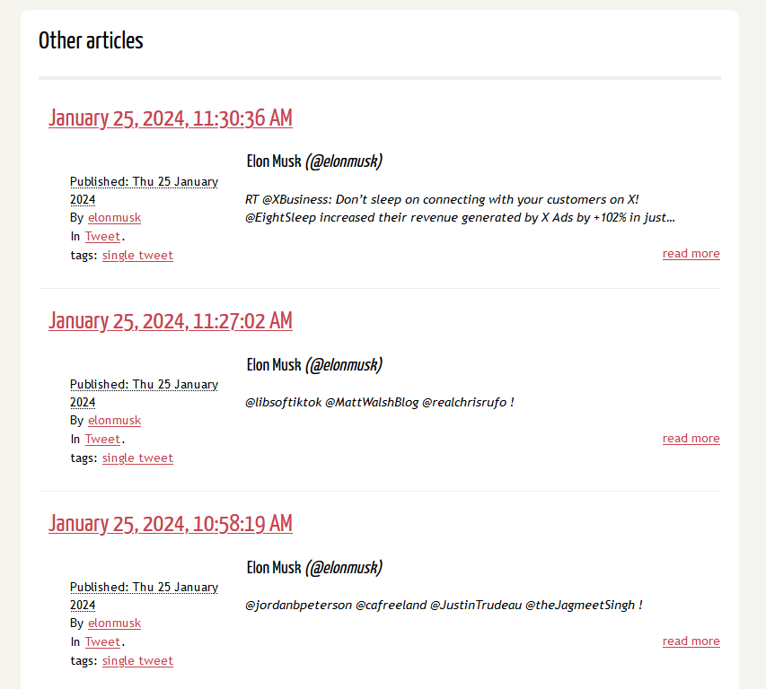

# ArXver 📖
___

## What
For making markdown pages from that one website for archival purposes.

### Features
- Chronology: Timestamps for each tweet
- Links to originals: available for image tweets
- Sorted: Solo tweets and reply chains are single post.
- Profiles: User handles, names, and pfps
- Tagging: sort posts based on media content
- Authors: sort tweets to see how often certain users interact
- Markdown: portable output

### Future content
- Add links to originals for text-only tweets.
- Figure out longer tweet chains (default is 3 right now). The conversation data is in there, it's a matter of stitching them together. Might need to break out a db.
- I'm not entirely certain the scraper is grabbing all tweets right now. Need to check on that. Maybe I underspecified in my archive.

## How To
Open a terminal emulator and run the commands you think work for you.

### Update tools
Probably haven't bothered to do this in 30 minor revisions, give it a try.
```
python3 -m pip install --upgrade pip setuptools
```

### Make a venv
A cluttered system python install is a miserable system python install. Do this instead:
```
python3 -m venv ./venv
```

#### Turn it on :\)
Linux/OSX:
```
source ./.venv/Scripts/activate
```

##### If you're lame(like me):
On Windows:
```
./.venv/Scripts/Activate.ps1
```
*If you don't use PowerShell on Windows, you can probably figure out which other script to run but, like, c'mon, grow up. Unless you're using WSL, then like, I have other questions....*

### Use a scraper
Well, it sucks twitter closed their public API. But! Web archivists are a tenacious kind. For this particular script, I'm not sure if other scrapers will work, actually. But twscrape will! So probably use that one. You can read about how to use that [here](https://github.com/vladkens/twscrape). Come back when you have your data.

Just in case, this is what mine kinda looked like after I set it up:
```
twscrape user_tweets_and_replies --raw --limit=100 44196397 > archive_data_1.txt
```

wait...a bit...
3200 tweets per acct per 15 minutes. Beware using accounts for scraping is a bannable offense pretty much anywhere.

### Install a Markdown to HTML converter for EZ blog cred
For convenience, we'll cover with Pelican, but this is just for converting the md files to a pre-made blog theme. 
```
python3 -m pip install "pelican[markdown]"
```
*If you know what you're doing, you can do what you like with the markdown files generated by this project. There are also markdown rendering apps like Obsidian you could totally just push these files into. The world is your oyster, crack open the possibilities.*

Make a directory for pelican to use
```
mkdir twt-archive-site 
```
```
cd .\twt-archive-site\
``` 
```
pelican-quickstart 
```

I mostly used the defaults in the quickstart, for a demo, we don't need the URL.


before we finish, add a config option to your pelicanconf.py
```

TIMEZONE = 'your time zone. I hope you read this'

DEFAULT_LANG = 'en'

MARKDOWN = {
    'extension_configs': {
        'markdown.extensions.nl2br': {},
        # Include other Markdown extensions here if needed
    },
    # ... other Markdown settings ...
}
```
The TIMEZONE line should have been set at quickstart, but maybe you weren't sure which one to use.
DEFAULT_LANG will give an error when you're hosting the site, for some reason the devs set it to 'english' but one of the libraries used expects 'en' or otherwise.
The MARKDOWN line will help with formatting tweets that have multiple lines(which is rare, but broke things)


## Then we found joy
Now that pelican is done with setup, we can move to running the program from this repo. You can run it for all the files you have(or one big one if you have that).

Here, we put the files into the pelican content folder, which is where it will expect raw markdown files.
```
python3 .\parse.py ..\scraping\archive_data_1.txt .\twt-arxv\content\
```

Should finish relatively quickly. Will take a little longer for more tweets. 
with ~12k tweets mine lasted ~1.5s.

now all the markdown files are in place, last two commands are pelican again

This will generate your HTML files:
```
pelican content
```
*This takes ~33 seconds on my machine.*

This will serve them:
```
pelican --listen
```

In your preferred web browser, go to http://127.0.0.1:8000, which is pelican's default, pelican should also tell you where it's hosting.

You should now see the chronological feed of all replies and tweets made by the account scraped, plus some extras. 10 at a time if you kept default pagination.




That's it!

## For Development

For formatting:
```
pip install black
```

*The rest is commentary.*
